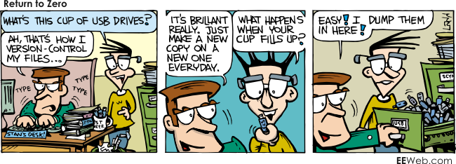

## "Version Managment"

I was fortunate enough to get the importance of configuration managment drilled into me early on when I started to learn programming. Although our configuration managment was rudimentary, it was effective when we were updating or fixing bugs on large projects
	
	
To our discredit however, our version managment was quite awful when I look back at it now. While I used to work for Oceanic there were only two of us who worked on all the programming projects for our department. We could afford to be a little bit lax with our versioning. By "a little bit lax" however, I mean that our version numbers were actually dates. We'd have a project named something like 20050607_project and many professional and even hobbyist programmers would burn us at the stake for this. 
	

What we did caused some immense problems and it eventually led to the biggest mistake I've ever made in made in my professional life. 
	
## Catastrophic Failure

In 2009 about a year and a half into an internship I was working at I was given the opportunity to start writing PHP code to connect an internal webapp that we were developing to allow managment to access and modify one of our databases. As I worked on the project I accessed a sample database to manipulate in case things went terribly wrong. The project went fairly smoothly and after a few weeks of teaching myself some rudimentary PHP I had a working product that I could show off to my supervisor and the department heads. My normal workflow when pushing a live app would be to create a copy of the directory that I was working in to push up to our live server. I dated the directory, pushed the version onto the server, and we met up to do a live demo of it. Everything seemed to work great!

Now here's where everyone will start to cringe, shake their heads, and yell at the top of their lungs at how monumentally I would be about to screw up.

I get back to my workstation and reopen the project to glance over it one more time before I close it away for the near future. I make sure to check my directory and make not that I was in the right folder -- date looks good -- and I think to myself "I should remove the test database that I was working on since I'll likely never have a reason to use it again." 

I can already feel what people are thinking right now and you're right. This was stupid. Already, it was really really stupid. And it gets worse.

So part of the changes that I made when I made the final version of the project was to change the url for the database I was connecting to. I had to switch from my test DB to our live one before I shipped it up to the server. Now remember when I said that our version control mostly consisted of dates? What this meant was that if I made several large scale changes a day (for instance, a revision to access live data instead of test data...) it would still be all encompassed under the version of the current date. There are so many things wrong with this so for the squeamish and faint of heart, please make sure you're able to get help if needed.

So here's what I ended up doing.

I decided because I'm cool and I didn't want to make a whole new project to delete my test database, I was just going to write a quick function in the current one that I just finished to drop the test database from the server. Made it. Ran it. Panic. Almost in slow motion I realized what I had just done. 

I had changed the database connection url to our live version and I had *just run an SQL DROP DATABASE query on it*.

Proper version managment could have saved me here. Normally what should have been done was first off, making a completely seperate branch version to push out to live. This version would only have the necessary changes needed to run on our live database. The master branch would still be looking at the test data. When I looked at my directory I just knew that I was in the right folder because it had the right date. Had I made proper version for each major revision I might have caught myself and remembered that this particular version that was made today was the live one. 

Thankfully the powers greater than me were able to restore everything however I learned several valuable lessons that day. First, DO NOT RUN A DROP DATABASE STATEMENT. EVER. And second, make PROPER version managment. One that doesn't lump all changes made in a day into one new version. One that actually has standards to it. Small revisions increment x amount. Large revisions increment y amount. Proper version management is an incredibly important thing and one that I think every single programmer both professional and hobbyist need to absolutely need to know and understand well.