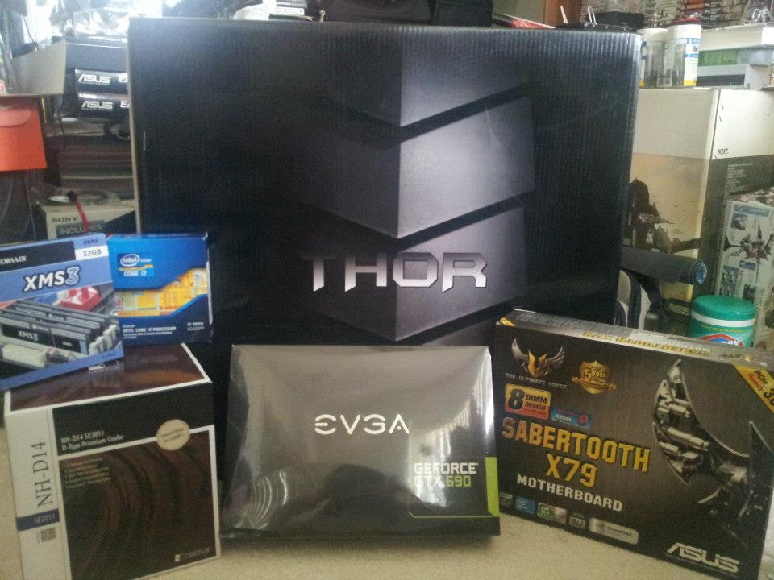
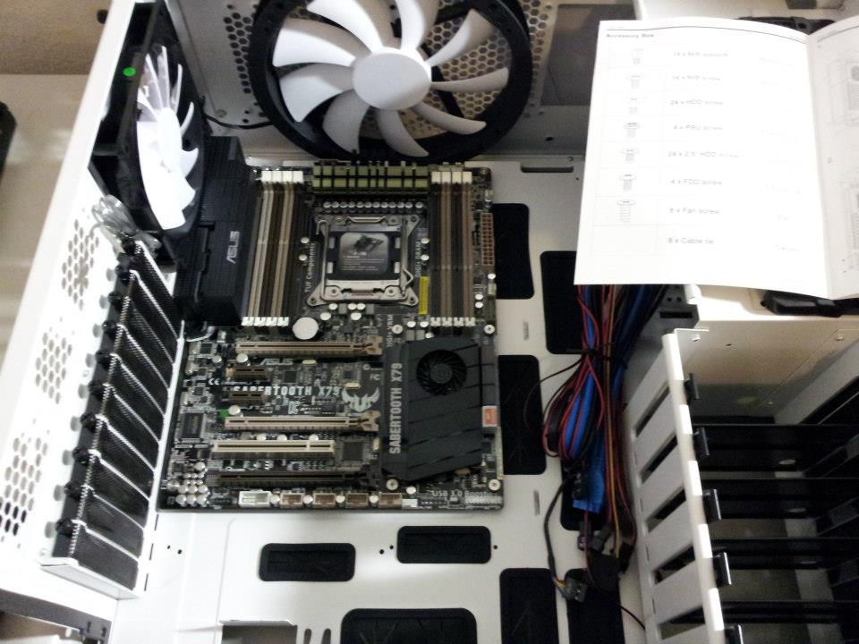
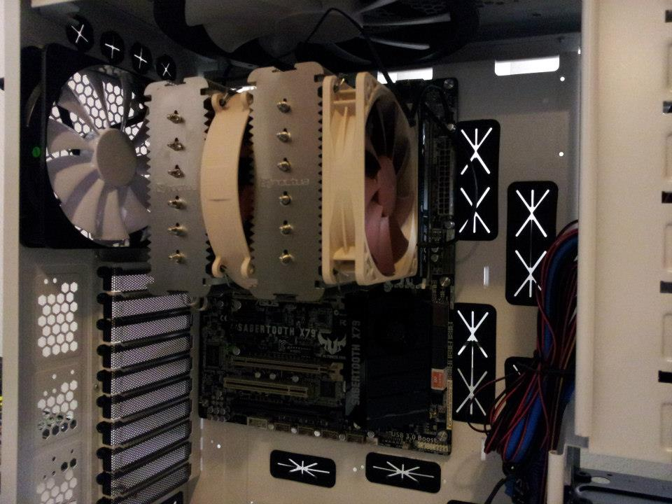
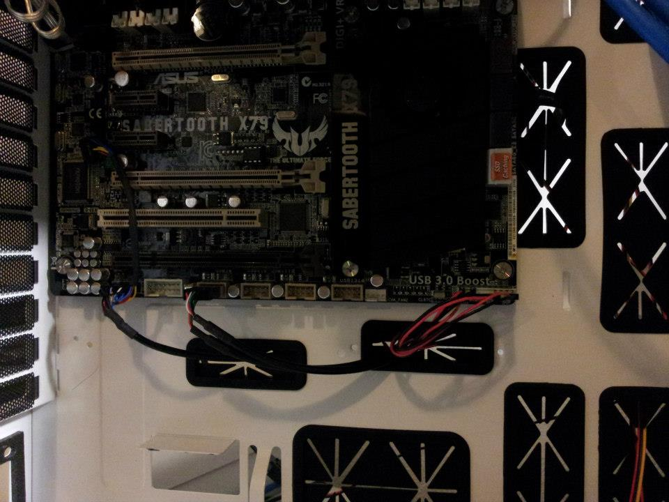
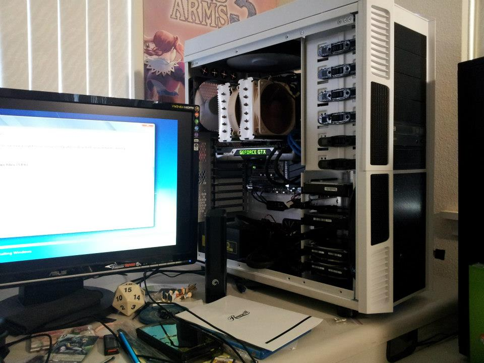

  

## A Fresh Slate

If you've never built a PC you don't know what satisfaction is. Getting parts in the mail is better than Christmas because unlike Christmas where you get clothes and socks, when you open up the shipping box and see those parts for the first time, you know that it's going to be something you'll use for years. 

Many people say building a PC is a difficult thing to do but I always counter with the argument: "If you can play with Legos, you can builed a PC". To what seems like a like a literal black box to them, PCs and it's components are surprisingly easy to work with. Like legos, they can only fit in a specific place and are engineer to ensure that you don't put something where it shouldn't be. As long as you read manuals and don't force things, anyone can build a PC!

  

Here I've just seated the motherboard. In my first build I almost ruined the whole thing by not putting spacers between my motherboard and the case chassis. I'm glad I double checked the manual before I powered on for the first time because if I didn't that would have been catastrophic electic failure! 

  

One of the reasons why I upgraded my old PC were due to some build issues that I had with the first one that I learned from. In my old build I used the stock heatsink and fan for the CPU and, while functional, it caused my processor to always idle at extremely high tempuratures which eventually led to it's early demise. For this build I did more reasearch and decided to go with an aftermarket heatsink and fan made by a company called Noctua. Their fans are extremely quiet even under load and work great. One caveat however is that because of it's design, cleaning the fins and fans is a huge pain.

  

Cable management. Cable management. Cable management. Every single IT will preach to the heavens about cable managament and for good reason too. It is imperative especially in a closed space like a computer case that your cables remain clean and out of the way for several reasons. First off it helps you make modifications and do maintenance so much easier. You won't have to move several cables over and hold them away while you clean out a part and when you add something new, your cable is already in place and ready to just be plugged in without having to maneuver through the maze. The second, and in my opinion, far more important reason is airflow. For computers that rely on fans and air to keep the insides at a reasonable temperature good airflow is an absolute requirment and every loose cable or hanging wire is an object that blocks air circulation. Cool air needs to come in and hit all components, not just cables.

  

After everything was seated and cables were tucked away, it was time to power on for the first time. It works! She lives! From here you've got a completely clean slate to do with whatver you wish and will be your partner for years to come.
